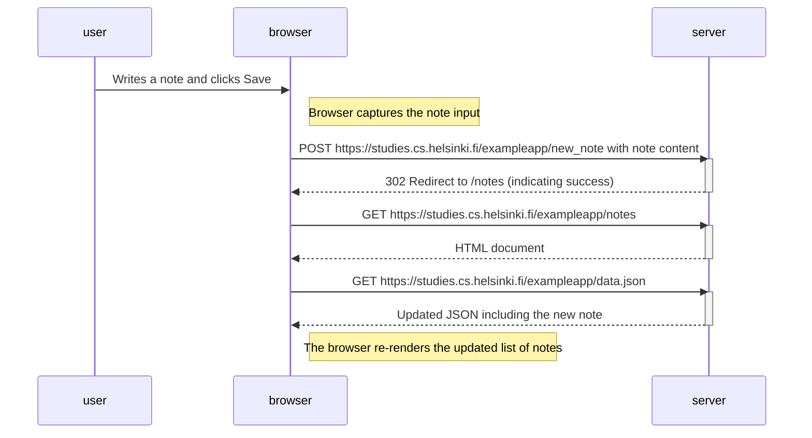

# Example of a Mermaid Diagram

```mermaid
sequenceDiagram
    participant user
    participant browser
    participant server

    user->>browser: Writes a note and clicks Save
    Note right of browser: Browser captures the note input
    
    browser->>server: POST https://studies.cs.helsinki.fi/exampleapp/new_note with note content
    activate server
    server-->>browser: 302 Redirect to /notes (indicating success)
    deactivate server

    browser->>server: GET https://studies.cs.helsinki.fi/exampleapp/notes
    activate server
    server-->>browser: HTML document
    deactivate server

    browser->>server: GET https://studies.cs.helsinki.fi/exampleapp/data.json
    activate server
    server-->>browser: Updated JSON including the new note
    deactivate server

    Note right of browser: The browser re-renders the updated list of notes

```